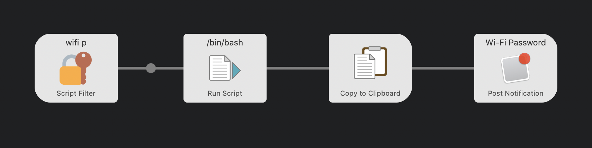

  <h1>Alfred Wi-Fi Password 🔐</h1>

  <strong>Get Wi-Fi password for specified network from Keychain</strong> 
  

## Requirements

- [`jq`](https://github.com/stedolan/jq) - Lightweight and flexible command-line JSON processor.

## Installation

1. [Install `jq`](https://stedolan.github.io/jq/download/). You must have `jq` installed in `/usr/local/bin`.
1. Download the Alfred Workflow ([Wi-Fi.Password.alfredworkflow](https://github.com/epilande/alfred-wifi-password/releases/latest/download/Wi-Fi.Password.alfredworkflow)).
1. Double-click to import into Alfred (requires Powerpack).

## Usage

`wifi p {network}` - Get Wi-Fi password of `{network}` from Keychain.

## More workflows

- 🔍 [alfred-browser-tabs](https://github.com/epilande/alfred-browser-tabs) - Search browser tabs from Chrome, Brave, & Safari.
- 🤫 [alfred-be-quiet](https://github.com/epilande/alfred-be-quiet) - Workflow to automatically pause audio/video playing.
- 🗝 [alfred-password-generator](https://github.com/epilande/alfred-password-generator) - Workflow to generate passwords.
- 🎨 [alfred-prettier-clipboard](https://github.com/epilande/alfred-prettier-clipboard) - Format code in your clipboard with Prettier.

## License

[MIT License](https://oss.ninja/mit/epilande/)
